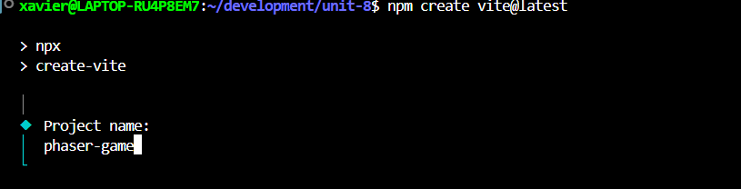
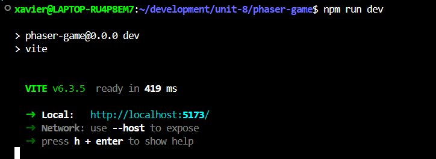

# phaser-game

## Apple Catcher

A simple apple catching game made on Phaser.

## How to get started

1. Open a new file in Vscode
2. Run npm create vite@latest

   

3. Choose Framework: Vanilla, and Variant: JavaScript or TypeScript
   

   

4. Cd into folder and run npm install
   

5. Run npm install phaser
   

6. And lastly, Run npm run dev

## Technologies Used

- Phaser
- React
- JavaScript
- HTML
- CSS
